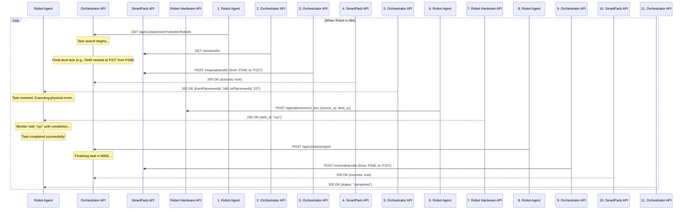

# Robot Integration Architecture: Orchestrator Pull-Model

## 1. Overview

This document outlines the architecture for integrating the SmartPack WMS with our physical warehouse robot(s). The goal is to create a robust, scalable, and error-resilient system for automating warehouse tasks, primarily stock replenishment.

We will implement a **Pull-Model**, where the robot is the initiator of work. This means an idle robot will actively request a task from a central "Orchestrator" service. This model is chosen over a "Push-Model" for its superior scalability to multiple robots and its inherent efficiency.

The system will consist of two primary custom-built components:
1.  **The Orchestrator API:** The central intelligence of the system. It communicates with the SmartPack API to find and assign tasks.
2.  **The Robot Agent:** A simple client application running for each robot, responsible for requesting tasks and controlling the robot's physical movements.

## 2. Core Principles

The entire system is built on these fundamental principles:

*   **Transactional Integrity:** Every task is treated as a single, atomic transaction: **Lock -> Execute -> Finalize**. A task is locked in SmartPack *before* it is assigned, ensuring no two robots can perform the same work.
*   **Centralized Intelligence:** The Orchestrator is the only component that contains business logic. It decides *what* needs to be done and *which* task is the highest priority.
*   **Decentralized Execution:** The Robot Agents are "dumb" workers. They only know how to ask for work, execute a physical move, and report the result. They contain no business logic.
*   **Real-time Data:** Every decision is made based on a fresh data pull from the SmartPack API. This prevents the system from acting on stale information.

## 3. System Components

### 3.1. The Orchestrator API (Bindeleddet)

This is a new web service (e.g., a Python Flask/FastAPI or Node.js Express app) that acts as the bridge between SmartPack and the robots.

**Responsibilities:**
*   Expose a simple API for robots to request tasks and report results.
*   Contain all logic for interpreting data from the SmartPack `sectioninfo` endpoint.
*   Identify the highest-priority task (e.g., finding a placement with `toRefill > 0`).
*   Manage the lifecycle of a transfer by correctly using SmartPack's `requesttransfer`, `committransfer`, and `canceltransfer` endpoints.
*   Remain stateless regarding the robots themselves. It doesn't track which robot is doing what; it just responds to requests as they come in.

### 3.2. The Robot Agent

This is a script or application that runs on, or has direct access to, each robot.

**Responsibilities:**
*   Continuously monitor the robot's internal status.
*   When the robot is idle, call the Orchestrator API to request a new task.
*   Translate `placementId`s received from the Orchestrator into the physical X/Y coordinates required by the Robot API.
*   Issue commands to the Robot API (primarily `move_box`).
*   Monitor the execution of the command until completion.
*   Report the final status (success or failure) of the task back to the Orchestrator API.

## 4. Detailed Workflow: A Single Replenishment Task

This sequence describes the entire lifecycle of one task, from start to finish.



## 5. Orchestrator API Endpoint Definitions

The following endpoints must be implemented by the Orchestrator service.

### `GET /api/v1/tasks/next`

Called by a Robot Agent to request a new task.

*   **Query Parameters:**
    *   `robotId` (string, optional): Identifier for the requesting robot (good for logging).
*   **Success Response (`200 OK`) - Task Found:**
    ```json
    {
        "taskId": "a_unique_guid_for_this_task",
        "fromPlacementId": 348,
        "toPlacementId": 227
    }
    ```
*   **Success Response (`204 No Content`) - No Tasks Available:**
    *   An empty response body with a `204` status code indicates no work is currently available.

### `POST /api/v1/tasks/report`

Called by a Robot Agent to report the final result of a task.

*   **Request Body:**
    ```json
    {
        "taskId": "the_guid_received_earlier",
        "fromPlacementId": 348,
        "toPlacementId": 227,
        "status": "success" // or "failed"
    }
    ```
*   **Success Response (`200 OK`):**
    ```json
    {
        "status": "acknowledged"
    }
    ```

## 6. Key Implementation Considerations

*   **Placement-to-Coordinate Mapping:** The Robot Agent needs a reliable way to map a `placementId` from SmartPack to a physical `(x, y)` coordinate for the robot. This mapping should be stored in a configuration file or a simple database accessible by the agent. The Robot API's `inventory/shelves` system could be an ideal place to manage this.
*   **Error Handling:**
    *   **Orchestrator -> SmartPack:** If a call to `requesttransfer` fails, the Orchestrator should find the *next* available task.
    *   **Robot Hardware Failure:** If the `move_box` operation fails, the Robot Agent **must** report `"failed"` to the Orchestrator. The Orchestrator will then call `canceltransfer` to release the lock in SmartPack, making the task available again for another robot (or the same one after a delay).
    *   **Network Failure:** Implement retry logic with exponential backoff for all API calls.
*   **Logging:** Both components must have extensive logging. The Orchestrator should log every decision it makes, and the Agent should log every command it sends to the robot. This is crucial for debugging.